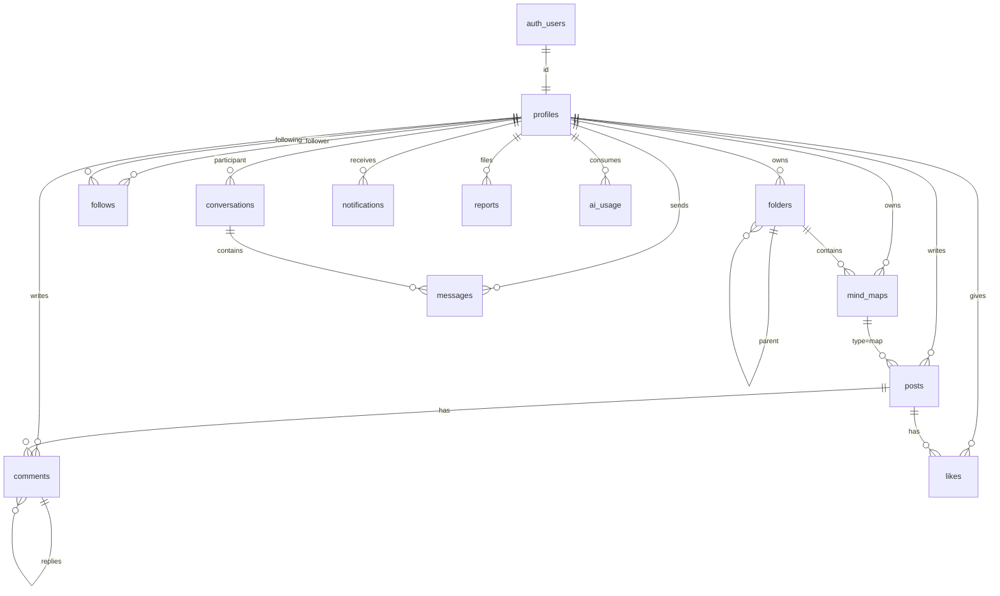

# MindSet — documentação do MVP

Documento de referência do produto **MindSet**: o que foi modelado, como o sistema está organizado e o que o MVP entrega hoje.

- Idioma da interface: português (Brasil)
- Repositório: `https://github.com/tnt-fhuffner/mindset.git`
- Hospedagem prevista: **Vercel** (Next.js) + **Supabase Cloud** (Postgres, Auth, Storage, Realtime)

---

## 1. Visão do produto

MindSet une três coisas num único app autenticado:

1. **Editor de mapas mentais na nuvem** (React Flow), com exportação e opção de edição conjunta via link.
2. **Timeline de conhecimento** — PDFs, e-books, artigos, imagens, links e mapas publicados, com curtidas, comentários e downloads rastreados.
3. **Camada social leve** — perfis, seguir pessoas, mensagens diretas, notificações e um painel admin.

A IA (Anthropic) é um assistente opcional que monta a estrutura de um mapa a partir de um tema, com **teto mensal por conta** no backend.

O público-alvo implícito é quem organiza estudo ou trabalho visualmente e quer compartilhar material, sem virar uma rede social genérica.

---

## 2. O que o MVP cobre (e o que não cobre)

### Pronto no MVP atual

| Área | Entrega |
| --- | --- |
| Conta | Cadastro por e-mail/senha (conta já confirmada), login, sessão via cookies SSR |
| Mapas | Criar, editar, pastas simples, visibilidade, exportar PNG/SVG/PDF/JSON, importar JSON |
| Colaboração | Toggle “Editar juntos”, presença (avatares), sync last-write-wins via Realtime |
| Timeline | Publicar 6 tipos de conteúdo, miniatura automática, editar/apagar o próprio post |
| Pessoas | Busca, sugestões, seguir/deixar de seguir, contagens no perfil |
| Mensagens | Conversas 1:1, realtime, UX master-detail no celular |
| IA | Gerar/sugerir estrutura de mapa, limite mensal + rate limit |
| Admin | Criar usuário, promover/rebaixar, bloquear, métricas, denúncias |
| Mobile | Shell com tab bar, chat em duas telas, editor de mapa em tela cheia |
| Legal | Páginas de termos e privacidade |

### Fora do MVP / incompleto de propósito

- **Google OAuth** existe no código, mas só aparece se `NEXT_PUBLIC_GOOGLE_AUTH=true` **e** o provider estiver ligado no Supabase. No estado atual permanece desligado.
- **Recuperação de senha** (`/forgot-password`) ainda reutiliza o formulário de login; não há fluxo real de reset.
- **Link mágico** não é o caminho principal; o cadastro cria o usuário já confirmado via service role.
- Menções (`notifications.type = mention`) existem no enum, mas não há UI de `@usuario` no compositor.
- Pastas de mapas são um prompt simples; não há arrastar mapa para pasta nem árvore aninhada na UI.
- Colaboração de mapa **não** é operational transform (OT/CRDT): é last-write-wins. Dois cursores editando o mesmo nó podem sobrescrever um ao outro.
- Rate limit de API é **em memória do processo** (não Redis): em serverless da Vercel cada instância tem o próprio contador.
- `/api/upload` ainda existe, mas o compositor envia o arquivo **direto ao Storage** no cliente para não bater no limite de body da Vercel (~4,5 MB).

---

## 3. Stack e arquitetura

```
┌─────────────┐     cookies SSR      ┌──────────────────────────┐
│  Browser    │ ◄──────────────────► │ Next.js 14 (App Router)  │
│  React 18   │                      │ Vercel                    │
└─────────────┘                      │  - páginas / rotas API   │
                                     │  - middleware de sessão  │
                                     └────────────┬─────────────┘
                                                  │
                     anon key + RLS               │ service role
                     (browser e server user)      │ (signup, admin)
                                                  ▼
                                     ┌──────────────────────────┐
                                     │ Supabase                  │
                                     │  Auth · Postgres · RLS    │
                                     │  Storage · Realtime       │
                                     └────────────┬─────────────┘
                                                  │
                                     Anthropic API (somente servidor)
```

### Pacotes principais

| Camada | Tecnologia |
| --- | --- |
| App | Next.js **14.2** App Router, TypeScript, Tailwind, shadcn/Radix |
| Estado servidor-cliente | TanStack Query |
| Mapas | `@xyflow/react` (React Flow 12) |
| Exportação | `html-to-image`, `jspdf` |
| PDF capa | `pdfjs-dist` (worker copiado para `public/` no `predev`/`prebuild`) |
| Auth/DB | `@supabase/ssr` + `@supabase/supabase-js` |
| IA | `@anthropic-ai/sdk` |
| Validação de API | Zod |

### Princípios de desenho

- **Postgres é a fonte da verdade.** O app quase não tem backend próprio: o browser fala com o Supabase sob RLS. Rotas Next só entram onde a chave anônima não basta (signup, admin, IA).
- **Service role nunca vai para o cliente.** Só `src/lib/supabase/admin.ts` e rotas `/api/*`.
- **Uploads no cliente** para arquivos grandes; validação por magic bytes antes de gravar no bucket.
- **UI em português**; tipos e nomes de tabela em inglês.

### Árvore relevante

```
src/
  app/                 # rotas App Router
    (app)/             # área logada (AppShell)
    api/               # signup, admin, ai, upload
    auth/callback/     # OAuth / magic link
    s/[token]/         # mapa compartilhado (público/unlisted)
    u/[username]/      # perfil público
  components/          # UI por domínio (maps, feed, messages, layout)
  hooks/               # React Query + Realtime
  lib/                 # supabase clients, posts, mind-map, validações
  types/               # contratos TypeScript
supabase/migrations/   # SQL canônico
scripts/               # ensure-admin, copy-pdf-worker
```

---

## 4. Modelagem de dados

Todas as tabelas de negócio ficam em `public`, com `id` UUID (exceto `likes`, `follows` e `ai_usage`, que usam chave composta). `profiles.id` é o mesmo UUID de `auth.users`.

### 4.1 Diagrama de entidades



### 4.2 Tabelas

#### `profiles`

Identidade pública. Criada automaticamente no trigger `on_auth_user_created`.

| Coluna | Tipo | Notas |
| --- | --- | --- |
| `id` | uuid PK | = `auth.users.id`, cascade |
| `display_name` | text | default `Usuário` |
| `username` | text unique | gerado do e-mail; sufixo numérico se colidir |
| `avatar_url` | text | Storage `avatars` |
| `bio` | text | |
| `role` | text | `admin` \| `user` (default `user`) |
| `is_blocked` | boolean | middleware encerra a sessão |
| `onboarding_completed` | boolean | dialog na lista de mapas |
| `created_at` / `updated_at` | timestamptz | |

**Regra de papel:** o e-mail mestre (`felipeqh.1991@gmail.com`, também em `NEXT_PUBLIC_MASTER_ADMIN_EMAIL`) entra como `admin` no trigger e é reafirmado por `ensure_master_admin()`. Ninguém rebaixa essa conta via auto-serviço: o trigger `protect_profile_privileges` impede o próprio usuário de alterar `role` / `is_blocked`; só `service_role` ou outro admin.

#### `folders`

Pastas opcionais do dono do mapa. `parent_id` permite árvore, mas a UI atual só cria pasta raiz.

#### `mind_maps`

| Coluna | Tipo | Notas |
| --- | --- | --- |
| `title` | text | |
| `content` | jsonb | documento do editor (ver §4.3) |
| `visibility` | text | `private` \| `public` \| `unlisted` |
| `share_token` | uuid unique | URL `/s/{token}` |
| `thumbnail_url` | text | ainda pouco usado no editor |
| `collaborative` | boolean | default false; se true, logados com o link podem **update** |
| `folder_id` | uuid nullable | |

Visibilidades:

- **private** — só o dono (e admin). Colaboração exige promover para `unlisted` ou `public`.
- **unlisted** — quem tem o token lê; se `collaborative`, quem está logado também edita.
- **public** — aparece no perfil público; mesma regra de collab.

O trigger `protect_map_collab` impede colaborador de roubar `owner_id`, `share_token`, `folder_id`, `collaborative` ou `visibility`.

#### `posts`

Conteúdo da timeline.

| `type` | Conteúdo esperado |
| --- | --- |
| `pdf` | arquivo PDF no Storage |
| `ebook` | PDF ou EPUB |
| `image` | PNG/JPEG/GIF/WEBP |
| `article` | texto (título + descrição) |
| `link` | `link_url` |
| `map` | `mind_map_id` |

Campos de arquivo: `file_url`, `file_path`, `file_mime`, `file_size`. Capa: `thumbnail_url`. Contador: `download_count` (RPC `increment_download`).

#### `likes`

PK `(post_id, user_id)`. Trigger `notify_like` avisa o autor.

#### `comments`

Texto 1–4000 caracteres. `parent_id` = resposta. Trigger notifica autor do post e, se for reply, o autor do comentário pai.

#### `follows`

PK `(follower_id, following_id)` com check de não seguir a si. Trigger `notify_follow`.

#### `conversations` / `messages`

Conversa **exatamente 1:1**. Índice único em `(least(a,b), greatest(a,b))` impede duplicata. Mensagem 1–8000 caracteres. `read_at` no destinatário. Trigger atualiza `last_message_at` e cria notificação `message`.

RPC `get_or_create_conversation(other_user uuid)` é o único jeito estável de abrir um chat a partir de um perfil.

#### `notifications`

Tipos: `like`, `comment`, `follow`, `message`, `mention`, `report`. Payload jsonb (ex.: `{ conversation_id }` em mensagem).

#### `reports`

Denúncia de `post` \| `comment` \| `file` \| `user` \| `map`. Status: `open` → `reviewed` \| `dismissed` \| `removed`. Só admin atualiza.

#### `ai_usage` / `ai_events`

`ai_usage`: PK `(user_id, month)` onde `month` é o primeiro dia do mês UTC. `used` incrementa via `consume_ai_credit`. `ai_events` é log simples de cada geração.

### 4.3 Documento JSON do mapa (`mind_maps.content`)

Contrato alinhado ao React Flow, persistido inteiro a cada autosave (debounce no editor).

```ts
{
  nodes: Array<{
    id: string;
    type?: "topic";
    position: { x: number; y: number };
    data: {
      label: string;
      color: string;      // hex da paleta NODE_COLORS
      icon?: string;      // sparkles | book | lightbulb | target | users | flag
      notes?: string;     // comentário dentro do balão
    };
  }>;
  edges: Array<{
    id: string;
    source: string;
    target: string;
    type?: "smoothstep";
  }>;
  viewport?: { x: number; y: number; zoom: number };
}
```

A IA devolve um **outline hierárquico** (`id`, `label`, `parentId`, `color`, `icon`) que `buildMindMapFromOutline` posiciona em árvore da esquerda para a direita.

### 4.4 Storage

| Bucket | Público | Limite | MIME |
| --- | --- | --- | --- |
| `uploads` | sim | 10 MB | PDF, EPUB, PNG, JPEG, GIF, WEBP |
| `avatars` | sim | 2 MB | PNG, JPEG, WEBP, GIF |

Objetos autenticados só podem ser gravados em pasta `{auth.uid()}/...`. Leitura é pública (URLs no feed). Admin pode apagar objeto de qualquer pasta.

---

## 5. Segurança

### 5.1 RLS (resumo)

Toda tabela de negócio tem RLS ligado.

| Recurso | Leitura | Escrita |
| --- | --- | --- |
| `profiles` | todos | próprio usuário; admin atualiza/apaga; trigger trava role/block |
| `folders` | dono / admin | dono |
| `mind_maps` | dono, public/unlisted, admin | dono/admin; collab se flag + visibilidade aberta |
| `posts` | todos, exceto autor bloqueado (autor e admin ainda veem) | autor / admin |
| `likes` / `comments` / `follows` | todos | próprio user |
| `conversations` / `messages` | participantes / admin | insert se for sender; update `read_at` se for receiver |
| `notifications` | dono | dono (marcar lidas) |
| `reports` | autor da denúncia / admin | insert próprio; update só admin |
| `ai_usage` / `ai_events` | próprio / admin | só via RPC `consume_ai_credit` (security definer) |

`is_admin()` é `security definer` e consulta `profiles.role` do `auth.uid()`, evitando recursão de política.

### 5.2 Middleware Next.js

Arquivo `src/lib/supabase/middleware.ts`:

- Rotas públicas: `/`, login/signup, termos, `/s/*`, `/u/*`, **todo `/api/*`**.
- Sem sessão em rota privada → redirect `/login?next=...` (`next` nunca aponta para `/api/*`).
- Usuário em página de auth → `/maps`.
- `is_blocked` → signOut + `/login?blocked=1`.
- `/admin` exige `role === admin`.

### 5.3 Uploads

`validateUpload` olha magic bytes (PDF `%PDF`, PNG, JPEG, GIF, WEBP, ZIP/EPUB). MIME declarado sozinho não basta. Tamanho default 10 MB (`UPLOAD_MAX_BYTES`).

### 5.4 Rate limits (processo)

| Chave | Limite |
| --- | --- |
| `signup:{ip}` | 40 / hora |
| `ai:{userId}` | 8 / 10 min |
| `upload:{userId}` | 20 / hora (rota `/api/upload`) |

Não substitui WAF; em scale, mover para Redis/Upstash.

---

## 6. Funções SQL, triggers e Realtime

### RPCs usadas pelo app

| Função | Quem chama | Função |
| --- | --- | --- |
| `get_or_create_conversation(other_user)` | mensagens / perfil | cria ou reutiliza o par |
| `increment_download(p_post_id)` | card do post | incrementa contador |
| `consume_ai_credit(p_limit)` | `/api/ai/generate` | lock da linha do mês, incrementa ou recusa |
| `get_admin_metrics()` | painel admin | JSON de totais |
| `ensure_master_admin()` | migrações | garante role admin no e-mail mestre |

### Triggers de domínio

- `set_updated_at` em profiles, maps, posts
- `handle_new_user` em `auth.users` INSERT
- `protect_profile_privileges` BEFORE UPDATE profiles
- `protect_map_collab` BEFORE UPDATE mind_maps
- `notify_*` em likes, comments, follows, messages

### Realtime (publication `supabase_realtime`)

Tabelas com `REPLICA IDENTITY FULL`: `messages`, `notifications`, `likes`, `comments`, `mind_maps`.

O cliente assina:

- canal `messages-{conversationId}` → INSERT em `messages`
- canal `notifications-realtime` → INSERT filtrado por `user_id`
- canal `map:{mapId}` → UPDATE em `mind_maps` + Presence

---

## 7. Migrações

Rodar **na ordem** no SQL Editor do Supabase (projetos já existentes podem aplicar só o que falta; os arquivos usam `if not exists` / `create or replace` onde dá).

| Arquivo | Motivo |
| --- | --- |
| `00001_init.sql` | Schema completo, RLS, storage, realtime, triggers, RPCs |
| `00002_fix_consume_ai_credit.sql` | Desambigua `used` na função de crédito de IA |
| `00003_post_thumbnails.sql` | `posts.thumbnail_url` (já incluso no init atual) |
| `00004_admin_roles_and_uploads.sql` | Service role pode mudar `role`; bucket 10 MB + PDF |
| `00005_app_fixes.sql` | Pacote “one-shot”: thumbnails + trigger + storage + crédito + master admin |
| `00006_map_collab.sql` | Coluna `collaborative`, política de update, trigger de proteção, realtime do mapa |

**Sem 00004/00005:** promover alguém a admin pela API parece funcionar e o trigger reverte para `user`.  
**Sem 00006:** o toggle “Editar juntos” não persiste / colaboradores não passam no RLS.

O `00001` atual já incorpora vários desses patches. Em banco **novo**, rode 00001 e depois 00006 (e 00005 se quiser o `ensure_master_admin` extra). Em banco **antigo** criado no início do projeto, rode a sequência inteira.

---

## 8. Autenticação e papéis

### Fluxos

1. **Signup (`POST /api/auth/signup`)**  
   Service role `createUser` com `email_confirm: true` → `ensureProfile` (role `user`, exceto e-mail mestre) → o cliente chama `signInWithPassword`. Senha mínima 6. Nome opcional.

2. **Login**  
   `signInWithPassword` no browser. Cookies via `@supabase/ssr`.

3. **Admin cria pessoa (`POST /api/admin`)**  
   Igual ao signup, mas pode passar `role: admin` (`overwriteRole: true`).

4. **Google**  
   `signInWithOAuth` só se `NEXT_PUBLIC_GOOGLE_AUTH=true`. Callback `/auth/callback` troca o código por sessão.

5. **Bloqueio**  
   Admin seta `is_blocked`. Próximo request no middleware desloga.

### Papéis

- **user** — tudo do produto, sem `/admin`.
- **admin** — métricas, criar/promover/bloquear, ver denúncias, apagar post/comentário/usuário, bypass de RLS onde as policies chamam `is_admin()`.

Script local (não commitar senha):

```bash
node scripts/ensure-admin.mjs email@dominio senha
```

---

## 9. Módulos da aplicação

### 9.1 Landing e páginas públicas

- `/` — proposta de valor e CTA para signup/login.
- `/terms`, `/privacy`
- `/s/[token]` — abre o editor em modo leitura, ou edição se o visitante está logado e o mapa é `collaborative`.
- `/u/[username]` — perfil público (mapas `public`, posts, seguir, mensagem). **Fora** do `AppShell` (sem tab bar).

### 9.2 Mapas (`/maps`)

- Lista + criar pasta (prompt) + criar mapa (redirect `/maps/[id]`).
- Editor: título, visibilidade, “Editar juntos”, nós (cor, ícone, notas), undo/redo, auto-layout, import/export, assistente de IA.
- Autosave debounce para `mind_maps`.
- Collab: Presence mostra iniciais; UPDATE remoto aplica o JSON se o hash mudou e não é eco do próprio save (~1,8 s de ignore).
- Exportação: antes do `html-to-image`, as arestas SVG recebem stroke inline (`#64748b`, width 2) para não sumirem no PNG/PDF.
- Mobile: tab bar some; toolbars com scroll horizontal; painel de IA empilha embaixo; minimap oculto.

### 9.3 Timeline (`/feed`)

- Abas **Para você** (últimos 50 posts) e **Seguindo**.
- Card: capa, curtida, comentários encadeados, download, compartilhar nativo / copiar link, repost (cria um post novo do tipo `link` apontando para o original).
- Dono: Editar / Apagar. Terceiros: Denunciar com confirmação (não dispara denúncia no primeiro toque dos 3 pontos).
- Clique no título/capa/descrição abre `/feed/[id]` com o conteúdo real (iframe PDF, imagem, link, mapa, artigo).
- Miniatura: primeira página do PDF via pdf.js, ou canvas com título; upload da capa no bucket `uploads`.

### 9.4 Pessoas (`/people`)

Busca debounce 250 ms + sugestões. Card com Seguir e atalho de mensagem. `WhoToFollow` no rodapé do feed.

### 9.5 Mensagens (`/messages`)

- Desktop: lista | thread.
- Mobile: um ou outro; voltar na header da thread; não auto-seleciona a primeira conversa.
- `?with={userId}` chama `get_or_create_conversation` e limpa a query da URL.
- Composer acima da tab bar e da safe area; scroll nativo (não Radix ScrollArea).
- Realtime de INSERT + invalidação React Query.

### 9.6 Notificações e configurações

- `/notifications` — lista + marcar todas como lidas.
- `/settings` — nome, username, bio, avatar.

### 9.7 Admin (`/admin`)

Métricas via `get_admin_metrics`, criar usuário, lista com promover/rebaixar/bloquear, denúncias.

---

## 10. APIs Next.js

| Método | Rota | Auth | Função |
| --- | --- | --- | --- |
| POST | `/api/auth/signup` | pública + rate limit IP | cria conta confirmada |
| POST | `/api/admin` | admin | cria usuário |
| PATCH | `/api/admin` | admin | role, block, status de report |
| DELETE | `/api/admin` | admin | apaga user/post/comment |
| POST | `/api/ai/generate` | sessão | consome crédito, chama Claude, devolve outline JSON |
| POST | `/api/upload` | sessão | upload via server (legado; compositor não usa) |

IA: `maxDuration = 60`, tenta `ANTHROPIC_MODEL` e depois fallbacks (`claude-sonnet-4-5`, `claude-3-5-sonnet-latest`, …). Só incrementa crédito se a geração passar. Resposta inválida/vazia vira JSON de erro (nunca HTML).

---

## 11. Mapa de rotas

### Públicas

| Caminho | Página |
| --- | --- |
| `/` | landing |
| `/login` `/signup` `/forgot-password` | auth |
| `/auth/callback` | troca de código |
| `/terms` `/privacy` | legal |
| `/s/[token]` | mapa compartilhado |
| `/u/[username]` | perfil |

### Autenticadas (`src/app/(app)`, `AppShell`)

| Caminho | Página |
| --- | --- |
| `/maps` `/maps/new` `/maps/[id]` | mapas |
| `/feed` `/feed/new` `/feed/[id]` `/feed/[id]/edit` | timeline |
| `/people` | descobrir |
| `/messages` | DMs |
| `/notifications` | sino |
| `/settings` | perfil próprio |
| `/admin` | só `role=admin` |

Navegação desktop: sidebar. Mobile: header + 5 abas (Mapas, Feed, Pessoas, Chat, Novo).

---

## 12. Cliente: estado e persistência

Hooks TanStack Query (chaves principais):

- `["profile"]`, `["feed", mode]`, `["people", search]`, `["conversations"]`, `["messages", id]`, `["notifications"]`, `["maps"]`, `["folders"]`, `["follow", userId]`, `["admin-metrics"]`

Supabase clients:

- `src/lib/supabase/client.ts` — browser, anon key  
- `src/lib/supabase/server.ts` — RSC/route handlers com cookies  
- `src/lib/supabase/admin.ts` — service role  
- middleware replica o client de cookies para refresh de JWT

O editor de mapa **não** usa React Query para o documento: estado local + debounce de `update` na linha. Collab entra pelo canal Realtime.

---

## 13. Mobile (estado atual)

Problemas que o MVP já trata:

- Altura com `dvh` + CSS vars `--app-header` / `--app-tabbar` (safe area iPhone).
- Viewport `viewportFit: cover` e `interactiveWidget: resizes-content` (teclado).
- Inputs `text-base` no mobile para o iOS não dar zoom.
- Mensagens: master-detail; compositor não fica sob a tab bar.
- Editor: tab bar oculta; IA empilhada; minimap escondido.

Perfil público `/u/...` continua sem o shell logado — decisão de produto (página também serve visitante anônimo).

---

## 14. Operação

### Variáveis de ambiente

Ver `.env.example`. Obrigatórias em produção:

- `NEXT_PUBLIC_SUPABASE_URL`
- `NEXT_PUBLIC_SUPABASE_ANON_KEY`
- `SUPABASE_SERVICE_ROLE_KEY` (signup + admin)
- `NEXT_PUBLIC_APP_URL` (URL canônica, usada no redirect OAuth)

Opcionais: `ANTHROPIC_API_KEY`, `ANTHROPIC_MODEL`, `NEXT_PUBLIC_GOOGLE_AUTH`, `NEXT_PUBLIC_MASTER_ADMIN_EMAIL`, `AI_MONTHLY_LIMIT` (default 15), `UPLOAD_MAX_BYTES`.

**Nunca** commitar `.env.local`.

### Scripts

```bash
npm run dev       # copia pdf.worker e sobe Next
npm run build
node scripts/ensure-admin.mjs <email> <senha>
```

### Checklist de um ambiente novo

1. Criar projeto Supabase.
2. Rodar migrações (§7).
3. Auth → URL Configuration: Site URL + `https://…/auth/callback`.
4. Preencher env na Vercel e fazer **Redeploy** (variáveis `NEXT_PUBLIC_*` entram no bundle só no build).
5. Confirmar bucket `uploads` / `avatars`.
6. (Opcional) ligar Google e `NEXT_PUBLIC_GOOGLE_AUTH=true`.
7. (Opcional) `ANTHROPIC_API_KEY`.

### Limites conhecidos de infra

- Body da Vercel ~4,5 MB → upload de PDF pelo browser, não pela API.
- Serverless sem disco persistente; worker do pdf.js vai para `public/` no build.
- Créditos de IA são por mês UTC, não fuso do usuário.

---

## 15. Decisões de produto já tomadas

1. Cadastro **aberto**; papel inicial **user**. Admin não é o único que convida.
2. E-mail mestre permanece admin mesmo se alguém tentar rebaixar pelo client.
3. Menu de 3 pontos prioriza compartilhar/repostar; denúncia é ação explícita e confirmada.
4. Clique no post abre o conteúdo; a timeline não é só um card morto.
5. Collab é “leve”: link + toggle, sem convites por e-mail nem ACL por pessoa.
6. Google fica off até o provider estar configurado de verdade (evita `validation_failed` no login).

---

## 16. Como evoluir (próximos passos naturais)

Ordem sugerida, se o produto sair do MVP:

1. Fluxo real de **reset de senha** e confirmação opcional por e-mail.
2. Rate limit compartilhado (Redis) e logs de auditoria admin.
3. Collab com lock por nó ou CRDT se a edição simultânea virar requisito.
4. Pastas de mapas com UI de arrastar; lixeira.
5. Busca full-text em posts/mapas.
6. Paginação cursor na timeline (hoje `limit 50`).
7. Perfil `/u/...` autenticado dentro do AppShell, ou um “voltar ao app” mais claro.
8. Testes E2E no chat mobile e no upload de PDF.

---

## 17. Glossário rápido

| Termo | Significado neste projeto |
| --- | --- |
| Unlisted | Mapa acessível só com `share_token`; não lista no perfil |
| Collaborative | Qualquer usuário logado com o link pode dar UPDATE no JSON |
| Service role | Chave secreta que ignora RLS; só servidor |
| Consume credit | RPC que reserva 1 geração de IA no mês |
| Master admin | E-mail fixo promovido pelo trigger `handle_new_user` |

Este arquivo descreve o sistema **como está no código do MVP**. Se uma migration não tiver sido aplicada no projeto Supabase de produção, o comportamento real daquele ambiente fica atrás deste documento até o SQL correspondente rodar.
